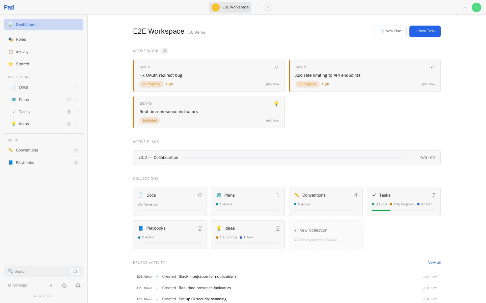

<p align="center">
  <h1 align="center">Pad</h1>
  <p align="center"><strong>Project management for developers and AI agents.</strong></p>
  <p align="center">
    <a href="https://github.com/xarmian/pad/actions/workflows/ci.yml"></a>
    <a href="https://github.com/xarmian/pad/releases"></a>
    <a href="LICENSE"></a>
  </p>
</p>

---

> One binary. Local-first. No accounts. Pad gives you a CLI, a web UI, and an AI agent skill — all backed by SQLite, all running on your machine. Your project data never leaves your laptop.

<!-- Screenshots: dashboard, board view, CLI output -->
<!-- TODO: Replace with actual screenshots -->
<!--
<p align="center">
  
</p>
-->

## Quick Start

```bash
brew install xarmian/tap/pad
cd your-project
pad auth configure
pad workspace init
pad server open
```

For a local install, choose `Local` in `pad auth configure`. Pad will remember that this client manages a local server, auto-start it when needed, and open the web UI at `localhost:7777`.

## Why Pad?

Tools like Linear, Jira, and Notion are built for teams on the cloud. Pad is built for **developers on their machine** — and for the AI agents working alongside them.

| | Pad | Linear / Jira | Notion |
|---|---|---|---|
| **Setup** | `pad auth configure` + `pad workspace init` | Create account, invite team, configure | Create account, pick template |
| **AI agents** | Native `/pad` skill for 7+ tools | Third-party integrations | Third-party integrations |
| **Data** | Local SQLite, you own it | Their cloud | Their cloud |
| **Offline** | Full functionality | Read-only cache at best | Limited |
| **CLI** | First-class | Afterthought | None |
| **Price** | Free, open source | Per-seat pricing | Per-seat pricing |

## Features

### For Developers

**CLI that doesn't get in your way.** Create tasks, search items, check status — without leaving the terminal.

```bash
pad item create task "Fix OAuth redirect" --priority high
pad item create idea "Real-time collaboration" --category infrastructure
pad item list tasks --status in-progress
pad item search "authentication"
pad project dashboard                   # Project dashboard
pad project next                        # What should I work on?
pad server info                         # How this client is connected to Pad
```

**Web UI that stays out of your way.** A clean, dark-themed interface at `localhost:7777` with:

- **Board, list, and table views** — drag-and-drop between status columns
- **Keyboard navigation** — `j`/`k` to move, `Enter` to open, `Esc` to go back, `Cmd+K` to search
- **Rich text editor** — Tiptap-based with markdown, formatting toolbar, and auto-save
- **Wiki-links** — type `[[Title]]` to link between items
- **Real-time updates** — agent creates a task in the terminal, it appears in the browser instantly (via SSE)
- **Dashboard** — collection overview, active work, plan tracking, activity feed

<!-- TODO: Screenshot of board view with drag-and-drop -->

### For AI Agents

**Your agent becomes a project partner.** Install the `/pad` skill once, and your AI coding tool can read, create, and update project items through natural language.

```bash
pad agent install        # Auto-detects your tools and installs the skill
```

Works with **Claude Code**, **Cursor**, **Windsurf**, **Codex**, **GitHub Copilot**, **Amazon Q**, and **JetBrains Junie**.

Then just talk to your project:

```
> /pad what should I work on next?
> /pad I finished the OAuth fix
> /pad create a task to add rate limiting
> /pad let's brainstorm about the API redesign
```

**Conventions and playbooks** teach agents how your project works:

- **Conventions** — trigger-based rules like "run tests before marking a task done" or "use conventional commits"
- **Playbooks** — multi-step workflows like "when implementing a feature: read the spec, create a branch, write tests first, then implement"

```bash
pad item create convention "Run tests before completing tasks" \
  --field trigger=on-task-complete \
  --field scope=all \
  --field priority=must
```

Agents load relevant conventions automatically. All agent actions are attributed in the activity feed, so you always know what the AI changed.

**Onboard agents to a new codebase:**

```bash
pad workspace onboard    # Analyzes project structure, saves workspace context, and suggests conventions
```

### Collections & Custom Fields

Pad organizes work into **collections** — typed containers with structured fields.

**Built-in collections:**

| Collection | Purpose |
|---|---|
| **Tasks** | Work items with status, priority, assignee, effort, due date |
| **Ideas** | Feature ideas with impact and category |
| **Plans** | Project milestones with progress tracking |
| **Docs** | Documentation, decisions, reference material |
| **Conventions** | Project rules that guide agent behavior |
| **Playbooks** | Multi-step workflows for agents to follow |

**Create your own** with typed fields — select, text, date, number, url, relation, checkbox:

```bash
pad collection create "Bug Reports" \
  --fields "severity:select:low,medium,high,critical; browser:text; reproducible:checkbox"
```

Items get reference numbers automatically (`TASK-5`, `BUG-12`) and can be moved between collections with field migration.

## Installation

### Homebrew (macOS and Linux)

```bash
brew install xarmian/tap/pad
```

### Build from Source

```bash
git clone https://github.com/xarmian/pad
cd pad
make build
cp pad ~/.local/bin/   # or /usr/local/bin/
```

Requires Go 1.25+ and Node.js 22+.

The `go install github.com/xarmian/pad/cmd/pad@latest` path is not supported for the full Pad binary, because the web UI must be built and embedded during the source build.

### Docker

```bash
docker run -p 127.0.0.1:7777:7777 -v pad-data:/data ghcr.io/xarmian/pad
```

This publishes Pad to `localhost:7777` on the host machine, which is the recommended default for local use.

To expose Pad beyond localhost intentionally, publish the port more broadly:

```bash
docker run -p 7777:7777 -v pad-data:/data ghcr.io/xarmian/pad
```

Use broader publishing only when you intend to make Pad reachable from other machines or interfaces.

### Docker Compose

The repo ships a `docker-compose.yml` that wires Pad + PostgreSQL + Redis. Before the first `docker compose up`, copy the env template and fill in a Postgres password:

```bash
cp .env.example .env
# Edit .env and set POSTGRES_PASSWORD (e.g. `openssl rand -base64 32`).
docker compose up -d
```

Compose refuses to start when `POSTGRES_PASSWORD` is missing — this is deliberate so a fresh deploy cannot silently inherit a known-weak default credential. The web UI binds to `127.0.0.1:7777` on the host by default. Set `PAD_BIND_ADDR=0.0.0.0` in `.env` to expose it to the LAN, or point a reverse proxy at the container on the `pad-net` network (see `docker-compose.prod.yml`).

### Binary Download

Pre-built binaries for macOS, Linux, and Windows are available on the [releases page](https://github.com/xarmian/pad/releases).

## Getting Started

### 1. Configure this Pad client

```bash
pad auth configure
```

For most local installs, choose `Local`. If you're connecting to another Pad server, choose `Remote` or `Docker` and enter its base URL.

### 2. Initialize a workspace

```bash
cd ~/projects/myapp
pad workspace init "My App"
```

This creates a `.pad.toml` file linking your project directory to a Pad workspace with default collections. Running `pad init` without `--template` in a terminal opens an interactive picker grouped by category (Software / People / …) so you can pick the one that fits.

```bash
pad workspace init --list-templates                   # See the full catalog grouped by category
pad workspace init "My App" --template scrum          # Scrum-style with sprints
pad workspace init "My App" --template product        # Product management focused
pad workspace init "My Hiring" --template hiring      # Company-side: requisitions, candidates, interview loops, feedback
pad workspace init "Job Search" --template interviewing  # Candidate-side: applications, interviews, companies, contacts
```

Pad ships templates for software (startup / scrum / product), people workflows (hiring, interviewing), and has reserved categories for research, content, operations, and personal use so the same project-management primitives fit well beyond code projects.

### 3. Install the AI skill

```bash
pad agent install            # Auto-detect and install for all found tools
pad agent install claude     # Or install for a specific tool
pad agent install cursor
pad agent install copilot
```

### 4. Start working

```bash
# From the CLI
pad item create task "Set up CI pipeline" --priority high
pad item create idea "Add WebSocket support" --category infrastructure
pad project dashboard

# From the web UI
pad server open              # Opens localhost:7777 in your browser

# From your AI agent
# Just use /pad in Claude Code, Cursor, etc.
```

### 5. Teach your agents the rules

```bash
pad workspace onboard        # Auto-analyze project, save workspace context, and suggest conventions
# Or browse the convention library
pad library list --type conventions  # Pre-built conventions you can adopt
pad library list --type playbooks    # Pre-built multi-step workflows
```

## CLI Reference

```
pad auth configure                    Configure how this client connects to Pad
pad auth setup                        Initialize the first admin account
pad auth login                        Sign in
pad auth whoami                       Show current user

pad server start                      Start the Pad API server
pad server stop                       Stop the Pad server
pad server info                       Show client, connection, and local server status
pad server open                       Open web UI in browser

pad workspace init [name]             Initialize workspace in current directory
pad workspace link <workspace>        Link current directory to an existing workspace
pad workspace list                    List all workspaces
pad workspace switch <workspace>      Switch active workspace
pad workspace context                 Show structured workspace context
pad workspace context set --file X    Update structured workspace context from JSON
pad workspace onboard                 Analyze project, save workspace context, and suggest conventions
pad workspace members                 List workspace members
pad workspace invite <email>          Invite a workspace member
pad workspace join <code>             Accept an invitation
pad workspace export                  Export workspace data
pad workspace import <file>           Import workspace data

pad project dashboard                 Project dashboard
pad project next                      Recommended next task
pad project ready                     Query actionable next items
pad project stale                     Query stalled or attention-worthy items
pad project standup [--days N]        Daily standup report
pad project changelog [--days N]      Release notes from completed items
pad project watch                     Real-time activity stream
pad project reconcile                 Reconcile item and PR state

pad item create <coll> "title"        Create item (task, idea, plan, doc, ...)
pad item list [collection]            List items (filters: --status, --priority, --all)
pad item show <ref>                   Show item detail
pad item update <ref>                 Update item fields
pad item delete <ref>                 Delete item
pad item move <ref> <collection>      Move item between collections
pad item edit <ref>                   Open item in $EDITOR
pad item search "query"               Full-text search across all items
pad item comment <ref> "text"         Add comment to an item
pad item comments <ref>               View item comments
pad item note <ref> "summary"         Append an implementation note to an item
pad item decide <ref> "decision"      Append a decision log entry to an item
pad item block <src> <target>         Create dependency
pad item blocked-by <item> <blk>      Mark item as blocked
pad item deps <ref>                   Show dependencies
pad item unblock <src> <target>       Remove dependency
pad item related <ref>                Show direct relationships for an item
pad item implemented-by <ref>         Show incoming implementers for an item
pad item bulk-update --status X       Batch update multiple items

pad collection list                   List collections with item counts
pad collection create <name>          Create a custom collection

pad library list                      Browse convention and playbook library
pad library activate <title>          Activate a convention or playbook

pad agent install [tool]              Install /pad skill for AI coding tools
pad agent status                      Show supported tools and installation status
pad agent update                      Update installed tool integrations

pad github link [item-ref]   Link current branch's PR to item
pad github status [item-ref] Show PR status for linked items
pad github unlink <item-ref> Remove PR link from item

pad webhook list             List workspace webhooks
pad webhook create <url>     Create webhook
```

All commands accept `--format json` for machine-readable output and `--workspace` to target a specific workspace.

### Authentication

Pad runs without authentication by default for frictionless local use. On a fresh instance, run `pad auth setup` on the server host to create the first admin account:

```bash
pad auth setup         # Initialize the first admin account
pad auth login         # Sign in
pad auth whoami        # Show current user
pad auth logout        # Sign out
```

Once a user exists, all API requests and web UI access require authentication. Credentials are stored in `~/.pad/credentials.json`. Multiple users can be invited to workspaces with role-based access control (`owner`, `editor`, `viewer`).

```bash
pad workspace members               # List workspace members
pad workspace invite user@example.com
pad workspace join <code>
```

## Architecture

```
┌──────────────────────────────────────────────┐
│              pad (single binary)              │
│                                               │
│  ┌──────────┐  ┌──────────┐  ┌────────────┐  │
│  │   CLI    │  │  REST    │  │  Embedded  │  │
│  │ (Cobra)  │  │  API     │  │  Web UI    │  │
│  └────┬─────┘  └────┬─────┘  │ (SvelteKit)│  │
│       │    HTTP      │        └────────────┘  │
│       └──────────────┤                        │
│                ┌─────▼─────┐                  │
│                │  SQLite   │                  │
│                │  + FTS5   │                  │
│                └───────────┘                  │
└───────────────────────────────────────────────┘
```

- **Go backend** — chi router, SQLite via [modernc.org/sqlite](https://pkg.go.dev/modernc.org/sqlite) (pure Go, no CGO), FTS5 full-text search, SSE for real-time updates
- **SvelteKit frontend** — Svelte 5, Tiptap editor, drag-and-drop, adapter-static, embedded via `go:embed`
- **Single binary** — serves the API and web UI, runs on macOS, Linux, and Windows
- **Workspace-per-project** — each project gets its own workspace linked by a `.pad.toml` file

All data lives in `~/.pad/pad.db`. Your data. Your machine. No telemetry, no cloud, no accounts.

## Contributing

See [CONTRIBUTING.md](CONTRIBUTING.md) for the development guide.

```bash
make build      # Build web UI + Go binary
make test       # Run Go tests
make dev-web    # SvelteKit dev server with hot reload
make install    # Build, install to ~/.local/bin, restart server
```

## Hardening for public deployments

Pad ships with defaults tuned for **local, single-user** development. If you plan to expose a Pad instance beyond `127.0.0.1` — whether to a LAN, a VPS, or the public internet — walk the checklist below before opening the firewall. None of these are optional once the server is reachable by an untrusted network.

### Network boundary

- **Bind to loopback by default.** Docker Compose publishes `127.0.0.1:7777:7777`. Keep that on any host the server shares with other users. Only set `PAD_BIND_ADDR=0.0.0.0` when the host's firewall or reverse proxy is already in front.
- **Terminate TLS in front.** Pad does not listen on TLS directly. Put Caddy, nginx, or a cloud load balancer in front so every request is HTTPS. Then set `PAD_SECURE_COOKIES=true` so session and CSRF cookies are flagged `Secure`.
- **Trust one proxy, not the internet.** If a reverse proxy is in front, configure `PAD_TRUSTED_PROXIES` with its CIDR(s). This gates the `X-Forwarded-For` / `X-Forwarded-Proto` / `X-Real-IP` headers so only traffic from your proxy can influence rate limits, the bootstrap loopback check, or the CLI-auth scheme. Leave it unset for direct-exposed deployments — Pad will then ignore proxy headers entirely.

  ```bash
  # Example for a single reverse proxy in a private subnet:
  export PAD_TRUSTED_PROXIES=10.0.0.0/8
  ```

### Secrets

- **Generate `PAD_ENCRYPTION_KEY` before the first start.** The SQLite build auto-generates one at `~/.pad/encryption.key`; the Postgres / clustered build refuses to start without an explicit key so replicas can't diverge. Rotate only during a maintenance window; rotating destroys any encrypted-at-rest values that were decrypted with the old key.

  ```bash
  openssl rand -hex 32   # paste into PAD_ENCRYPTION_KEY
  ```

- **Scope API tokens deliberately.** `POST /api/v1/auth/tokens` accepts a `scopes` field. `["*"]` grants full access (useful for CI / agents that must write) and `["read"]` limits the token to safe methods. Unrecognized scope strings are **denied** as of TASK-667 — tokens with legacy custom scopes must be reissued with one of the supported values.
- **Bootstrap from the server host.** `pad auth setup` is gated on the loopback check for exactly this reason: it creates an unauthenticated window during which the first admin is minted. Open that window only while physically on the server, then close it by completing the bootstrap.

### Authentication hardening

- **Enable strict session IP binding for high-sensitivity workloads.** `PAD_IP_CHANGE_ENFORCE=strict` rejects requests whose client IP no longer matches the one recorded at session creation. Good for server-to-server API use; breaks mobile roaming, VPN toggles, and carrier NAT for interactive users — leave unset (log-only mode) for most deployments. Either mode writes an `ActionSessionIPChanged` audit-log row.
- **Make password strength visible to users.** Bootstrap / register / rotation / reset now enforce a minimum zxcvbn score of 2 plus identity-aware penalties (email, name, username). Surface the returned `validation_error` text in your UI so users understand why a password was rejected rather than blaming themselves.
- **Require CORS origins explicitly.** Set `PAD_CORS_ORIGINS` to the comma-separated origins of your web UI hosts. Without this, cookie-authenticated browser fetches from other origins are rejected by default — which is what you want.

### Observability

- **Gate `/metrics` with a shared bearer.** Set `PAD_METRICS_TOKEN` to a 32-byte hex string. Without it, `/metrics` is reachable **only from loopback** — safe for Prometheus on the same host, but useless for external scrapers. With the token set, every scrape must send `Authorization: Bearer $PAD_METRICS_TOKEN`.
- **Forward audit-log entries.** `GET /api/v1/admin/audit-log` (admin-only) exposes login attempts, password changes, token issuance, session-IP changes, and member/role changes. Ship them to your log aggregator for alerting — the most interesting events (`login_failed`, `session_ip_changed`, `token_created`) are the ones you'll want dashboards on.

### CI gates

The project ships two security gates you should mirror in your deployment pipeline:

- **`npm audit --audit-level=high --production`** — run from `web/` to block frontend PRs that pull in vulnerable deps.
- **`govulncheck ./...`** — run at the repo root to block Go PRs that pull in vulnerable deps. Install with `go install golang.org/x/vuln/cmd/govulncheck@latest`.

Both are fast enough to run in PR CI.

### Quick checklist

Before flipping a Pad deployment public:

- [ ] TLS terminated in front, `PAD_SECURE_COOKIES=true`
- [ ] `PAD_TRUSTED_PROXIES` configured (or the server is directly exposed)
- [ ] `PAD_ENCRYPTION_KEY` set from a cryptographically random source
- [ ] `PAD_CORS_ORIGINS` allow-list configured for the UI's origin(s)
- [ ] `PAD_METRICS_TOKEN` set (or `/metrics` is loopback-only by accident)
- [ ] `pad auth setup` completed so the bootstrap window is closed
- [ ] Audit log shipped to external storage
- [ ] `npm audit` + `govulncheck` running in CI

## Security

See [SECURITY.md](SECURITY.md) for reporting vulnerabilities.

## License

[Apache License 2.0](LICENSE)
